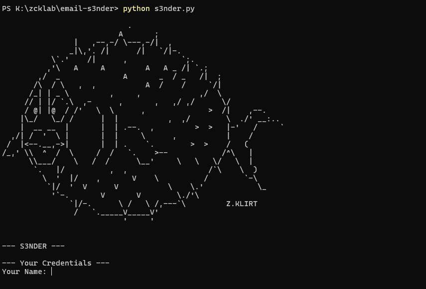

# S3NDER



A fast, manual email outreach script. It generates personalized emails in 19 languages using your data and spintax, letting you preview everything in the terminal before sending via Gmail.

## ✨ Features
- **19 Languages** & **Spintax** (`{Hi|Hello}`) built-in.
- **Dynamic Data**: Auto-fills company info and your signature.
- **Manual QA**: Review every email before pressing send.

---

## 🚀 Installation & Setup

### 1. Requirements
- Python 3.8+

### 2. Get the Project
Clone the repository and install the single dependency:

```bash
git clone https://github.com/zckLab/email--s3nder.git
cd email--s3nder
pip install -r requirements.txt
```

### 4. Configure Your Gmail Credentials
To send emails, the script uses your Gmail account securely through an **App Password** (this keeps your real password safe).

1. Rename `example.env` to `.env`.
2. Go to your [Google Account Security Settings](https://myaccount.google.com/security).
3. Ensure **2-Step Verification** is turned ON.
4. Go to [App Passwords](https://myaccount.google.com/apppasswords).
5. Open the app selector and choose "Mail". Open the device selector and choose "Windows Computer" (or your OS).
6. Click **Generate**.
7. Copy the 16-character password provided by Google.
8. Open the `.env` file and replace the placeholder credentials:

```env
EMAIL_USER=your_email@gmail.com
EMAIL_PASS=xxxx xxxx xxxx xxxx
```

---

## 🛠️ Usage Guide

To start the program, open your terminal in the project folder and run:

```bash
python s3nder.py
```

### 1. Enter Your Details (Signature)
The script will first ask for your personal details. These will be automatically inserted at the bottom of every template using the `{Name} | {Occupation} | {WebSite/Portfolio}` format.
```text
Your Name: John Doe
Your Occupation: Web Developer
Your Portfolio/Website: johndoe.com
```

### 2. Select a Language 
Type the language code you want to use for this batch of emails (e.g., `en`, `pt`, `es`).

**Not sure which languages are supported?** 
Type `language --help` when prompted to see the full list of available language codes:
```text
Select Email Language: language --help

Supported Languages:
  pt      en
  es      pl
  it      de
  ...
```

### 3. Input Company Data
The script will ask how many companies you want to email. For each company, you will need to provide:
- **Company Email**
- **Company Name**
- **City**
- **Service Type** (e.g., "Web Design", "Plumbing")
- **Rating** (e.g., "4.8")
- **Number of Reviews** (e.g., "120")

### 4. Preview and Send
Before anything is sent, S3NDER will show you a preview of the specific email generated for that company. 

```text
  Subject: Quick idea for Tech Solutions Inc.
  ------------------------------
  Hello,
  I found Tech Solutions Inc. while searching for Web Design...
  ------------------------------

  Send to info@techsolutions.com? (y/n): 
```
- Type `y` and press Enter to send the email.
- Type `n` and press Enter to skip this company and move to the next one.

At the end of the process, you will see a summary of how many emails were successfully sent and how many failed.
